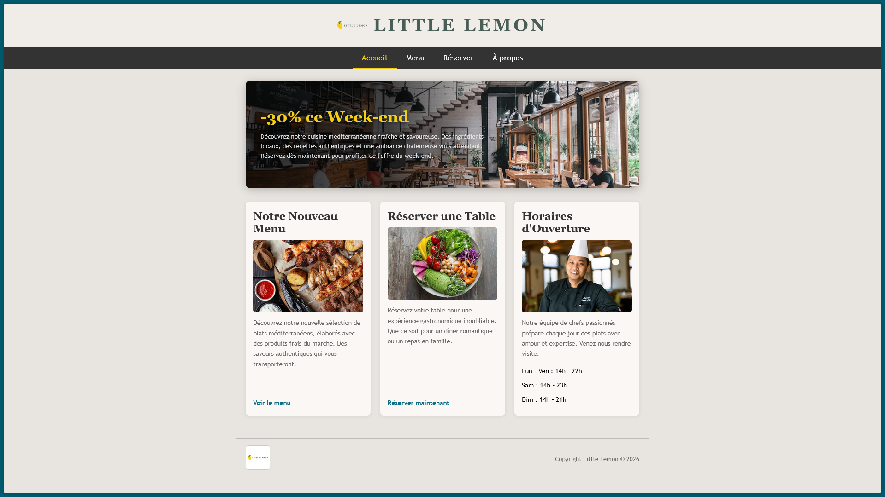
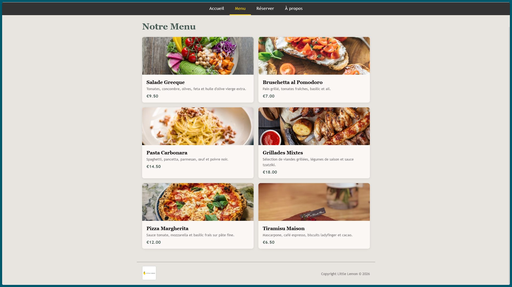
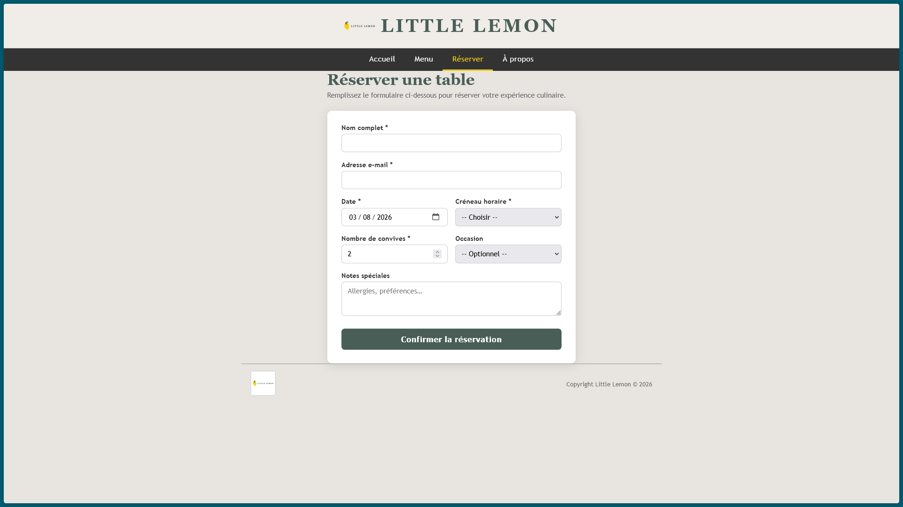
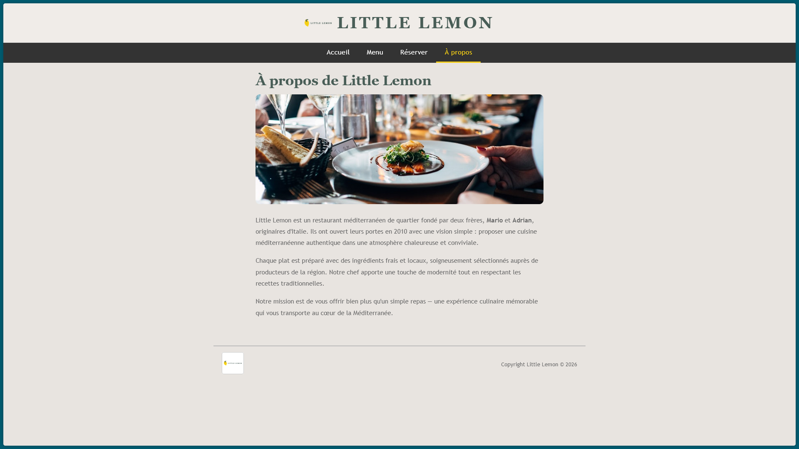

# Site de Réservation Little Lemon

## Description du Projet
Ce projet a été créé dans le cadre du cours de Développement Front-End de Meta sur Coursera. Ce site web est l'aboutissement du parcours de développement Front-End.

Ce site présente l'implémentation d'une application de réservation pour le restaurant Little Lemon. Il a été développé avec des composants React pour démontrer la maîtrise de ce framework dans la création de sites web. Le projet inclut également l'utilisation d'appels API.

Veuillez noter : au-delà du design, la seule fonctionnalité opérationnelle sur ce site est la fonction "Réserver une table".

## Captures d'écran
Voici quelques captures d'écran de l'application illustrant la fonctionnalité de réservation.

